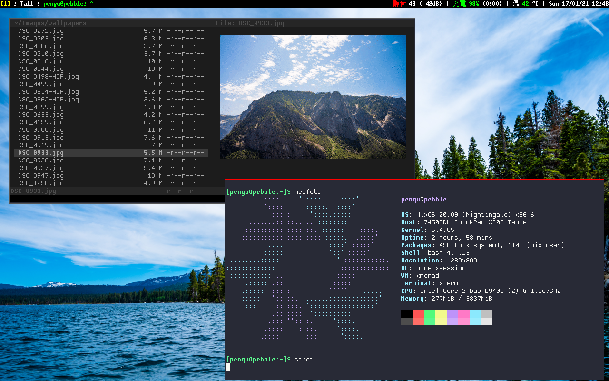

# NixOS Configs

These are my Nix and Home Manager configs. They include dotfiles and things like
that that have been ported over. This allows for incredibly portable and
automated builds of the exact same system configuration and RICE across all my
systems.

## Usage

Things in the folder `nixpkgs` are supposed to go into `~/.config/nixpkgs`. The
file `configuration.nix` goes to `/etc/nixos/configuration.nix`. Afterwards run
`nixos-rebuild switch` and `home-manager switch`. Certain things need to be
changed/done as well or you might get stuck.

- Change network interface names in `configuration.nix`
- Change user/git details
- Install home-manager

## Configured things

Check within `nixpkgs/programs` and `nixpkgs/services`. I suggest you use this as 
guide instead of as a drop-in replacement.

A list of some things that have been configured:
- XResources uses [dracula](https://github.com/dracula/xresources)
- Crap ton of nvim things
- Okular vim-like keybinds (have to manually add)
- Firefox with hardened user.js
- XMonad & XMobar & Rofi
- vifm with sixel preview
- Texlive with my conveniences
- Dunst
- And more
